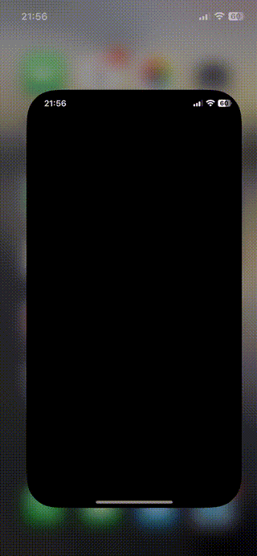

# CombineAPIRrest
This repository contains a sample iOS application. The app implements a simple iOS app that implements TCA (The Composable Architecture). This is the base code used in following post [Harnessing NFC Technology in your iOS App](https://javios.eu/blog)

## 🎥 Demo Video

Check out the app in action!  
  

## Requirements

- **Xcode 15.0 or later**
- **iOS 16.0 or later**
- **Swift 6.0**

